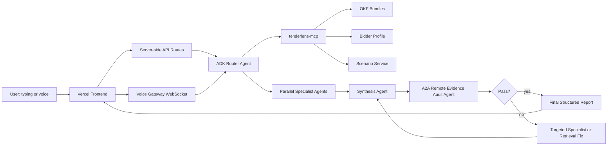
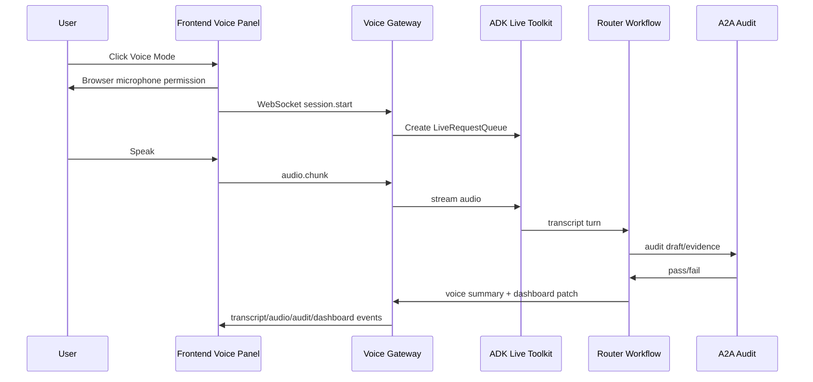

# Architecture Guide

TenderLens Agentic AI is a bidder-side tender decisioning system. It uses agents as the product brain and OKF + RAG as the evidence foundation.

## High-Level Flow

## Agent Collaboration

The Router Agent is the root coordinator. It receives typed questions or voice transcript turns, chooses the workflow path, gathers evidence through MCP, runs parallel specialists, synthesizes the decision, and invokes the A2A Evidence Audit Agent before final output.

## Parallel Agents

The parallel analysis block runs after intake, OKF selection/build, and evidence retrieval. These agents can work over the same evidence package at the same time:

- Compliance Agent
- Eligibility / Profile Fit Agent
- Commercial Fit Agent
- Risk Agent
- Timeline Agent
- Bid Strategy Agent
- Clarification Question Agent

The goal is to make the analysis modular: compliance gaps, commercial fit, risk, timeline, strategy, and issuer questions are separate concerns with separate outputs.

## Bounded Evidence Quality Loop

The loop is the pre-release review cycle:

1. Synthesis creates a draft.
2. A2A Evidence Audit reviews it independently.
3. If audit passes, the final report is released.
4. If audit fails, Router sends the issue to the relevant existing specialist or Retrieval Agent.
5. Synthesis rebuilds.
6. A2A audits again.
7. Stop after pass or max 2 revision rounds.

The Targeted Specialist Agent is not a new standalone role. It means the existing specialist responsible for the failed section.

## A2A Evidence Audit Agent

The audit agent is mandatory. It is exposed through ADK A2A support and consumed by the main workflow. It checks citations, unsupported claims, weak evidence, schema validity, Arabic mode, voice response grounding, privacy/logging concerns, and contradiction between specialists.

This agent gives the project a real A2A use case: an independent reviewer that improves the trustworthiness of the recommendation.

## OKF + RAG

Curated tenders are represented as OKF bundles:

- `index.md` for navigation
- `log.md` for update history where useful
- concept documents with YAML frontmatter
- citation sections
- internal concept links

RAG retrieves concept-level and section-level evidence. Specialist agents receive citations and source metadata, not free-floating summaries.

## MCP Tools

The app-local MCP server exposes evidence and profile tools:

- tender listing
- OKF index/concept retrieval
- evidence search
- bidder profile retrieval
- requirement scoring
- scoring rubric lookup
- strategy simulation
- clarification candidate generation
- OKF validation
- upload status
- voice session context

Strict tool filtering keeps each agent's tool surface intentional.

## Voice Mode

Voice is an adapter into the same agent system:

Voice does not create a separate product brain. It drives the Router workflow and keeps detailed evidence visible in the dashboard.

## Frontend / Backend Communication

Typing mode:

- Browser calls a Vercel server route such as `/api/analyze`.
- Server route calls local/deployed ADK backend.
- Response is structured for the dashboard.

Voice mode:

- Browser opens a `wss://` route after user action.
- Voice gateway streams audio/transcripts/events.
- Secrets remain server-side.

## Deployment

Primary deployment:

- Frontend: Vercel
- Main ADK backend: Agent Runtime
- Voice gateway: Vercel WebSockets/Fluid Compute if reliable

Fallback voice deployment:

- Cloud Run FastAPI WebSocket service, only after explicit approval.

## Observability And Evals

Agents CLI evals verify behavior and tool trajectories. Cloud Trace captures deployed workflow evidence where available. `docs/CONCEPT_MAP.md` maps concepts to exact code, UI, eval, video, and writeup evidence before Kaggle submission.
